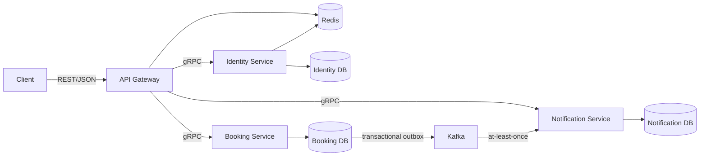

# SeatFlow

SeatFlow is a small event-seat reservation system built to demonstrate reliable concurrent booking in Go. Its central problem is simple to describe and difficult to implement correctly: when many users try to reserve the same seat, exactly one request may succeed.

> **Status:** repository bootstrap complete; local infrastructure is the next milestone.

## Project Goals

SeatFlow is a learning-oriented microservice project focused on PostgreSQL transactions, explicit row locking, idempotency, asynchronous delivery, and graceful service operation. PostgreSQL is the source of truth for seat availability. Redis may support sessions and rate limiting, but it must never decide whether a seat is available.

The system uses synchronous REST/gRPC calls when the caller needs an immediate result. Booking events are delivered asynchronously through Kafka using a transactional outbox. Delivery is **at least once**, not exactly once; consumers must therefore be idempotent.

## MVP Scope

- Register, sign in, and rotate refresh tokens.
- Browse events, shows, and available seats.
- Hold one to four seats, then confirm or cancel the reservation.
- Expire unconfirmed reservations automatically.
- View notifications produced from booking events.
- Prevent duplicate reservations with idempotency keys.
- Run locally with Docker Compose and deploy through Helm.
- Exercise unit, integration, concurrency, race, and end-to-end tests.

## Non-goals

The first release excludes real payments, email/SMS delivery, social login, a full admin UI, event sourcing, distributed transactions, service mesh, multi-region deployment, database sharding, and claims of exactly-once delivery. A React frontend and payment service may be considered only after the core workflow is complete.

## Architecture

SeatFlow has four independently runnable services:



The Gateway owns the external HTTP boundary; Identity owns users and sessions; Booking owns seat state, reservations, expiry, and outbox publication; Notification consumes events and deduplicates them. The services share one PostgreSQL server during the MVP but use separate logical databases and credentials.

See [the architecture overview](docs/architecture.md) for boundaries and consistency rules, and [the ADR directory](docs/adr/README.md) for decision records.

## Development

Requires Go 1.26 and Task 3. The bootstrap has no third-party Go dependencies.

```bash
task build      # build all four binaries into bin/
task test       # run unit and process-level integration tests
task test-race  # run the suite with Go's race detector
task run        # start all four process skeletons; Ctrl-C stops them
```

Run `task help` to see which planned tasks become available in later issues. Each process validates configuration before starting. The Gateway requires `SEATFLOW_ENV` and `HTTP_ADDR`; the three internal services require `SEATFLOW_ENV` and `GRPC_ADDR`. `task run` supplies local defaults.

All processes emit JSON logs with `service` and `environment` fields. Their `main` functions own the root signal context, and the shared lifecycle waits for SIGINT or SIGTERM before exiting cleanly. Resource-specific shutdown is intentionally deferred until those resources exist.
